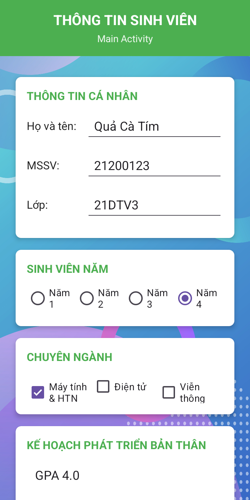
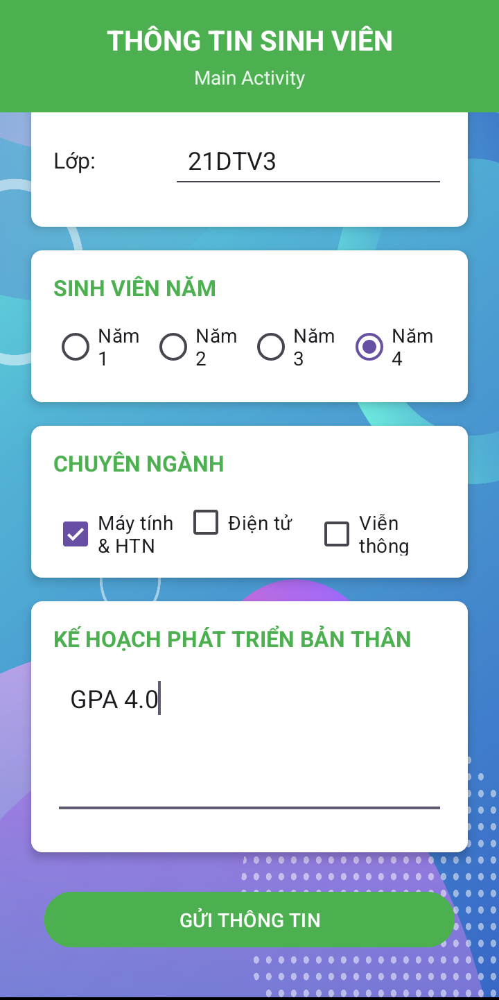
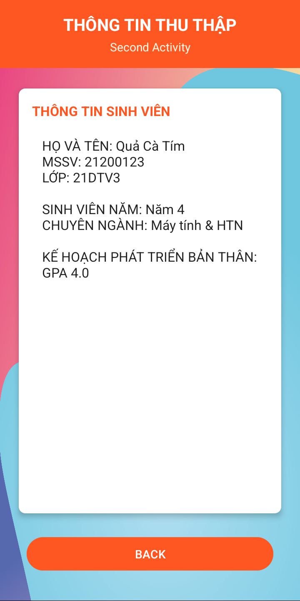

# Ứng dụng Thông tin Sinh viên

Ứng dụng Android đơn giản giúp sinh viên nhập và hiển thị thông tin cá nhân, bao gồm các chi tiết về học tập và kế hoạch phát triển bản thân.

## Mô tả

Ứng dụng "Thông tin Sinh viên" được phát triển để thu thập và hiển thị thông tin sinh viên một cách có tổ chức. Ứng dụng bao gồm hai màn hình chính:

- **Màn hình Nhập thông tin**: Nơi sinh viên nhập thông tin cá nhân, năm học, chuyên ngành và kế hoạch phát triển bản thân
- **Màn hình Hiển thị thông tin**: Nơi hiển thị tất cả thông tin đã được nhập từ màn hình đầu tiên

Ứng dụng sử dụng kiến thức về vòng đời Activity, Intent và startActivityForResult để truyền dữ liệu giữa các màn hình, đảm bảo luồng công việc mượt mà và hiệu quả.

## Tính năng chính

- Giao diện thân thiện với người dùng với các trường nhập liệu rõ ràng
- Thu thập thông tin cá nhân (họ tên, MSSV, lớp)
- Lựa chọn năm học (Năm 1, 2, 3 hoặc 4) bằng RadioButton
- Chọn chuyên ngành (có thể chọn nhiều) bằng CheckBox
- Nhập kế hoạch phát triển bản thân qua trường văn bản đa dòng
- Kiểm tra tính hợp lệ của dữ liệu trước khi gửi
- Hiển thị tất cả thông tin đã nhập trên màn hình thứ hai
- Hình nền tùy chỉnh cho mỗi màn hình

## Hình ảnh minh họa

### Màn hình ứng dụng

| Nhập thông tin (Phần 1) | Nhập thông tin (Phần 2) | Hiển thị thông tin |
|:-------------:|:----------------:|:----------------:|
|  |  |  |

## Cấu trúc ứng dụng

Ứng dụng bao gồm hai màn hình chính:

1. **MainActivity**: Màn hình cho sinh viên nhập thông tin cá nhân và học tập
2. **SecondActivity**: Màn hình hiển thị tất cả thông tin đã nhập

## Luồng dữ liệu

1. Sinh viên nhập thông tin cá nhân, chọn năm học, chuyên ngành và kế hoạch phát triển
2. Khi nhấn nút "GỬI THÔNG TIN", dữ liệu được kiểm tra tính hợp lệ
3. Nếu dữ liệu hợp lệ, thông tin được gửi đến SecondActivity (REQUEST_CODE: 99)
4. SecondActivity hiển thị thông tin đã nhập
5. Khi nhấn nút "BACK", người dùng quay lại MainActivity (RESULT_CODE: 88)

## Yêu cầu hệ thống

- Android 14.0 (API level 34 - "UpsideDownCake") hoặc cao hơn
- Android Studio

## Cách cài đặt

1. Clone repository này về máy local
2. Mở dự án bằng Android Studio
3. Sync Gradle và build project
4. Chạy ứng dụng trên thiết bị thật hoặc máy ảo

## Công nghệ sử dụng

- Java
- Android SDK
- LinearLayout, ScrollView và CardView
- Activity Lifecycle
- Intent và startActivityForResult
- RadioGroup, CheckBox và EditText

## Thiết kế giao diện

- Sử dụng CardView để tạo giao diện hiện đại, có bóng đổ
- Phối màu thống nhất: xanh lá (#4CAF50) cho MainActivity, đỏ cam (#FF5722) cho SecondActivity
- Tiêu đề và nhãn được làm nổi bật với chữ in đậm
- ScrollView cho phép cuộn khi nội dung vượt quá kích thước màn hình
- Hình nền tùy chỉnh (background_1.jpg và background_2.jpg) cho mỗi màn hình

## Giấy phép

Dự án được phân phối dưới giấy phép MIT. Xem file `LICENSE` để biết thêm chi tiết.

## Tác giả

© 2025 - Được phát triển bởi Eggpant203 🍆

---

_Lưu ý: Đây là dự án học tập, nhằm mục đích thực hành các kỹ năng lập trình Android cơ bản. Mọi đóng góp và phản hồi đều được chào đón._
